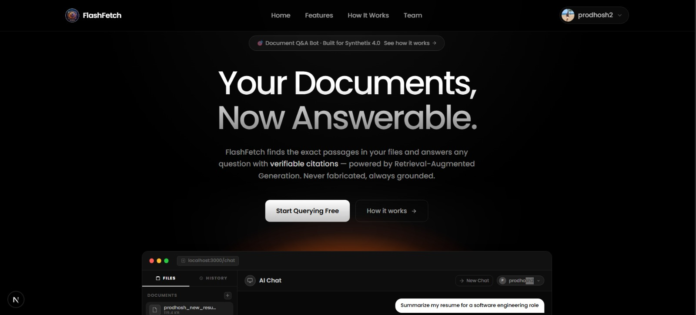
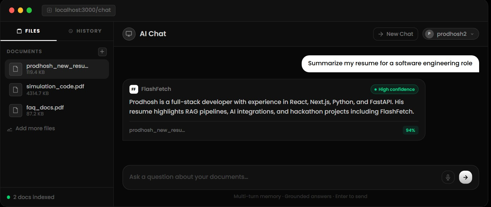
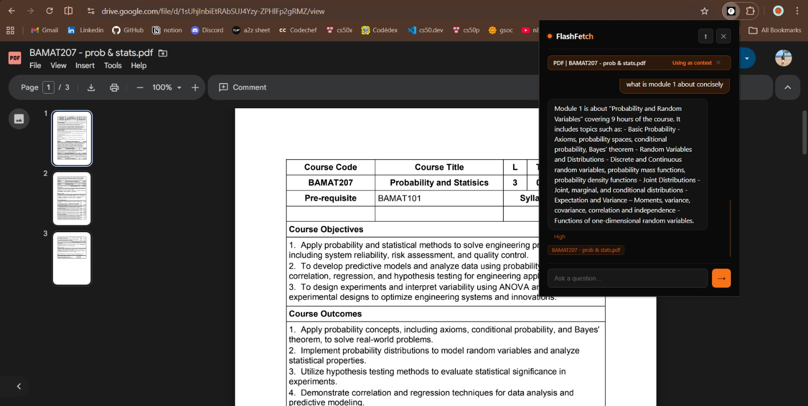
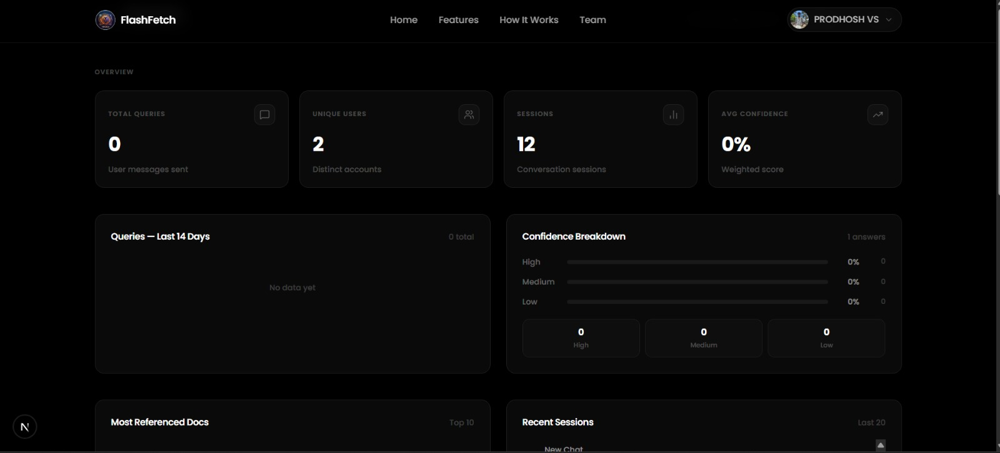

<div align="center">
  

  # FlashFetch

  **Ask anything about your documents — grounded, cited, instant.**

  [](https://nextjs.org)
  [](https://python.org)
  [](https://fastapi.tiangolo.com)
  [](https://supabase.com)
  [](https://groq.com)
  [](LICENSE)

  *Built for **Synthetix 4.0** · VIT Chennai · 24 Hours*
</div>

---

## What is FlashFetch?

FlashFetch is a **RAG-powered (Retrieval-Augmented Generation) document QA platform**. Upload any PDF, TXT, or Markdown file — then ask questions in plain language. Every answer is:

- **Grounded** — pulled only from your documents, never fabricated
- **Cited** — shows the exact filename, page, chunk, and quoted passage
- **Scored** — a High / Medium / Low confidence rating based on cosine similarity

Available as a **web app** and a **Chrome extension** that works directly on Google Drive PDFs.

---

## Screenshots

### Landing Page


### Chat Interface — Confidence + Citations


### Chrome Extension


### Admin Dashboard


---

## Features

| # | Feature | Description |
|:--|:--------|:------------|
| 01 | Multilingual | Ask in Tamil, Hindi, Telugu, French, Arabic — auto-detected, answered in kind |
| 02 | Voice Input | Click mic, speak — auto-fills via Web Speech API. Zero backend required |
| 03 | Shared Links | One-click public read-only link to any session. No login to view |
| 04 | Confidence Scoring | High >= 0.75 · Medium 0.45–0.74 · Low < 0.45 — score shown on every answer |
| 05 | Source Citations | Filename · Page · Chunk · Similarity score · Full quoted passage + copy |
| 06 | Chat History Search | Full-text search across every past session, jump to any match |
| 07 | Chrome Extension | Chat with any Google Drive PDF without uploading to the server |
| 08 | Admin Dashboard | Queries, users, confidence breakdown, top documents, daily volume |

---

## How RAG Works

```
Your document (PDF / TXT / MD)
         split into ~500-token chunks
         each chunk → embedding via sentence-transformers
         stored in FAISS index

Your question → vectorised
         FAISS finds top-3 most similar chunks (cosine similarity)
         similarity score → High / Medium / Low confidence label

top-3 chunks + question → Groq LLaMA 3
         Answer grounded only in your documents
         + source file · page · chunk · quoted passage
```

---

## Tech Stack

```
Frontend      Next.js 15  ·  TypeScript  ·  Tailwind CSS v4  ·  shadcn/ui
Backend       Python  ·  FastAPI  ·  FAISS  ·  sentence-transformers
LLM           Groq — LLaMA 3.1 8B Instant
Database      Supabase (PostgreSQL + Auth + RLS + RPCs)
Extension     Chrome MV3  ·  Vanilla JS
```

---

## Project Structure

```
top-devs/
├── app/
│   ├── page.tsx                 # Landing page
│   ├── chat/page.tsx            # Main chat interface
│   ├── admin/page.tsx           # Admin dashboard
│   └── share/[id]/page.tsx      # Public shared session viewer
├── components/
│   ├── chat-interface.tsx       # Chat UI — voice, citations, confidence
│   └── ui/                      # Navbar, footer, auth modal, animated hero
├── rag-backend/
│   ├── main.py                  # FastAPI — /ask  /ingest  /extract-url
│   ├── retriever.py             # FAISS vector search + cosine similarity
│   ├── generator.py             # Groq LLM + confidence scoring + multilingual
│   └── ingest.py                # PDF/TXT/MD chunking + embedding pipeline
├── flashfetch-extension/
│   ├── manifest.json            # Chrome MV3
│   ├── popup.html / popup.js    # Extension chat UI
│   ├── background.js            # Context menu handlers
│   └── content.js               # Page text extractor
└── supabase/
    ├── chat-history.sql         # Sessions · messages · search RPC · share RPC
    └── admin.sql                # Admin users · analytics · RLS policies
```

---

## Getting Started

### 1 — Clone

```bash
git clone https://github.com/PRODHOSH/rag-document-qa-bot.git
cd rag-document-qa-bot
```

### 2 — Frontend

```bash
npm install
cp .env.example .env.local
# set NEXT_PUBLIC_SUPABASE_URL, NEXT_PUBLIC_SUPABASE_ANON_KEY, NEXT_PUBLIC_API_URL
npm run dev
```

### 3 — Backend

```bash
cd rag-backend
python -m venv ../.venv
../.venv/Scripts/activate        # Windows
# source ../.venv/bin/activate   # macOS / Linux
pip install -r requirements.txt
uvicorn main:app --port 8000 --reload
```

### 4 — Supabase

Run in Supabase SQL Editor (in order):
1. `supabase/chat-history.sql`
2. `supabase/admin.sql`

Grant admin access:
```sql
INSERT INTO public.admin_users (user_id)
VALUES ('your-supabase-auth-uid');
```

### 5 — Chrome Extension

1. Open `chrome://extensions/`
2. Enable **Developer mode**
3. **Load unpacked** → select `flashfetch-extension/`
4. Details → enable **Allow access to file URLs**

---

## Environment Variables

```env
# .env.local  (frontend)
NEXT_PUBLIC_SUPABASE_URL=https://xxxx.supabase.co
NEXT_PUBLIC_SUPABASE_ANON_KEY=eyJ...
NEXT_PUBLIC_API_URL=http://localhost:8000

# rag-backend/.env  (backend)
GROQ_API_KEY=gsk_...
```

---

## Team

<div align="center">

<pre>
 /|\        /|\        /|\        /|\
/ \        / \        / \        / \

PRODHOSH VS   S.SHARAN   ASHISH REDDY   NAWAZ
 Developer     Content     Research      Design
</pre>

| Name | Role |
|:-----|:-----|
| **Prodhosh V.S** | Team Lead · Full-Stack · RAG Backend |
| **S. Sharan** | Content · Problem Framing |
| **Ashish Reddy** | Research · Testing |
| **Mohamed Nawaz** | Design · UI |

*Competing at **Synthetix 4.0** — organised by HumanoidX Club, VIT Chennai*

</div>

---

<div align="center">
<sub>Built with love in 24 hours · Synthetix 4.0 · 2026</sub>
</div>